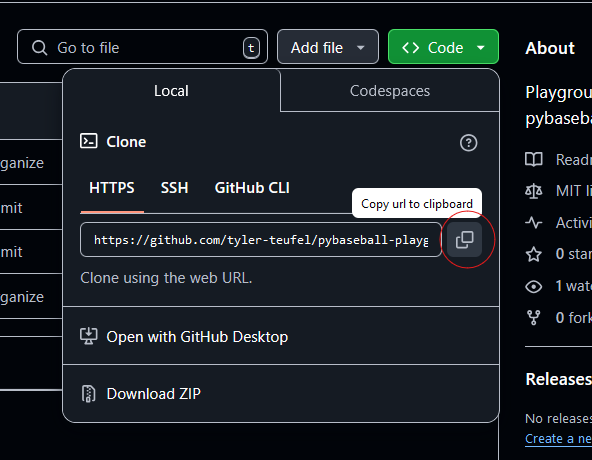

# Get Setup Locally

### \* Disclaimer \*

I want to put it out there that I use VS Code for all of my coding, and I personally recommend it not only due to how clean the UI is but also due to the extensions available. Integration with new programming languages as well as plugins for GitHub make the experience getting setup and using version control with a remote repository MUCH easier.

---

## Clone remote repository

Assuming you already installed git, the first step is to clone the remote repo from GitHub. The way you go about this is through first heading to the repo on Github ([here](https://github.com/tyler-teufel/pybaseball-playground)) :


Next, click on the green 'Code' button to get the link to the repository:



Then, copy the link to your clipboard, and head over to a terminal, (in the example images I am using Git Bash), and cd into the directory you want to store this project in. Then, run the following command:

```bash
git clone https://github.com/tyler-teufel/pybaseball-playground.git
```

It should look something like this:


Once the repo is cloned, open it in whatever IDE you use, (Integrated Development Environment, ex: VS Code, PyCharm, Spyder, etc.), and checkout whatever branch you plan on doing work in:

```bash
git checkout docs-working
```

as an example, I included the command I used for checking out the branch I pushed all of this documentation to.
